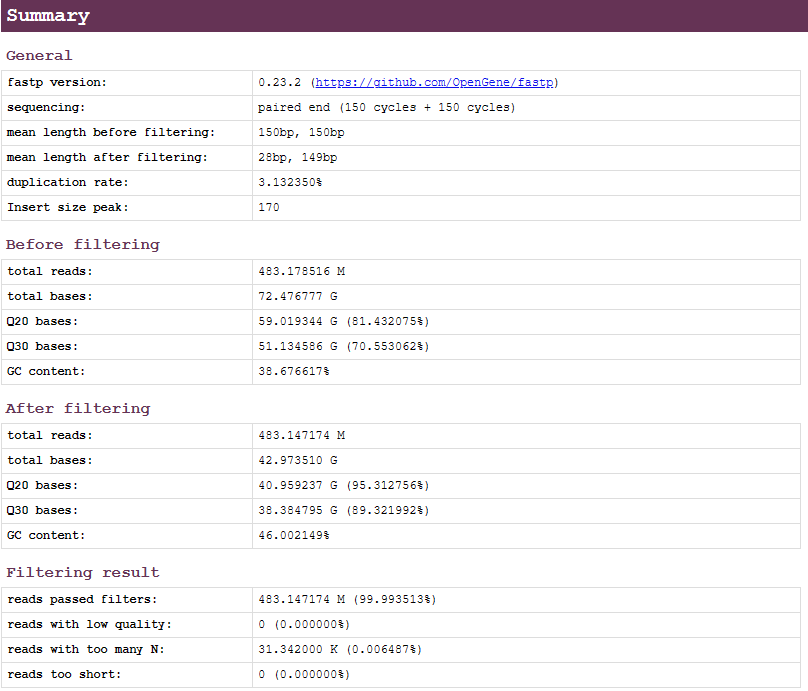
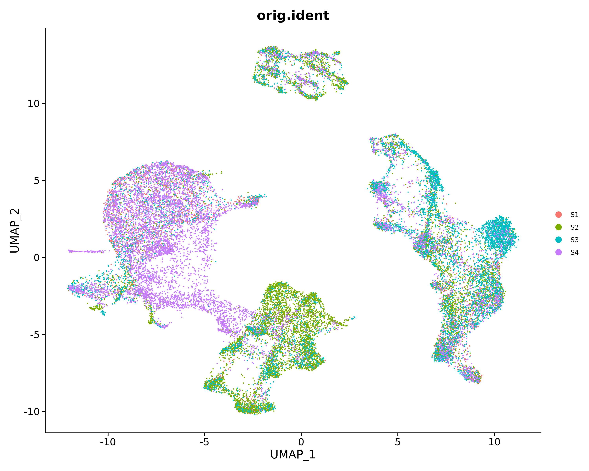
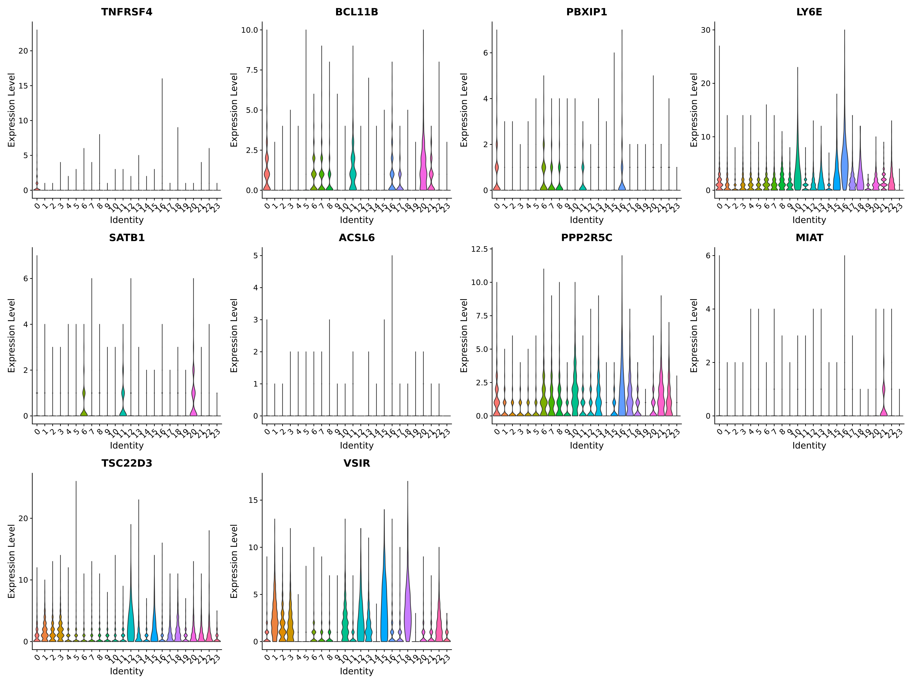
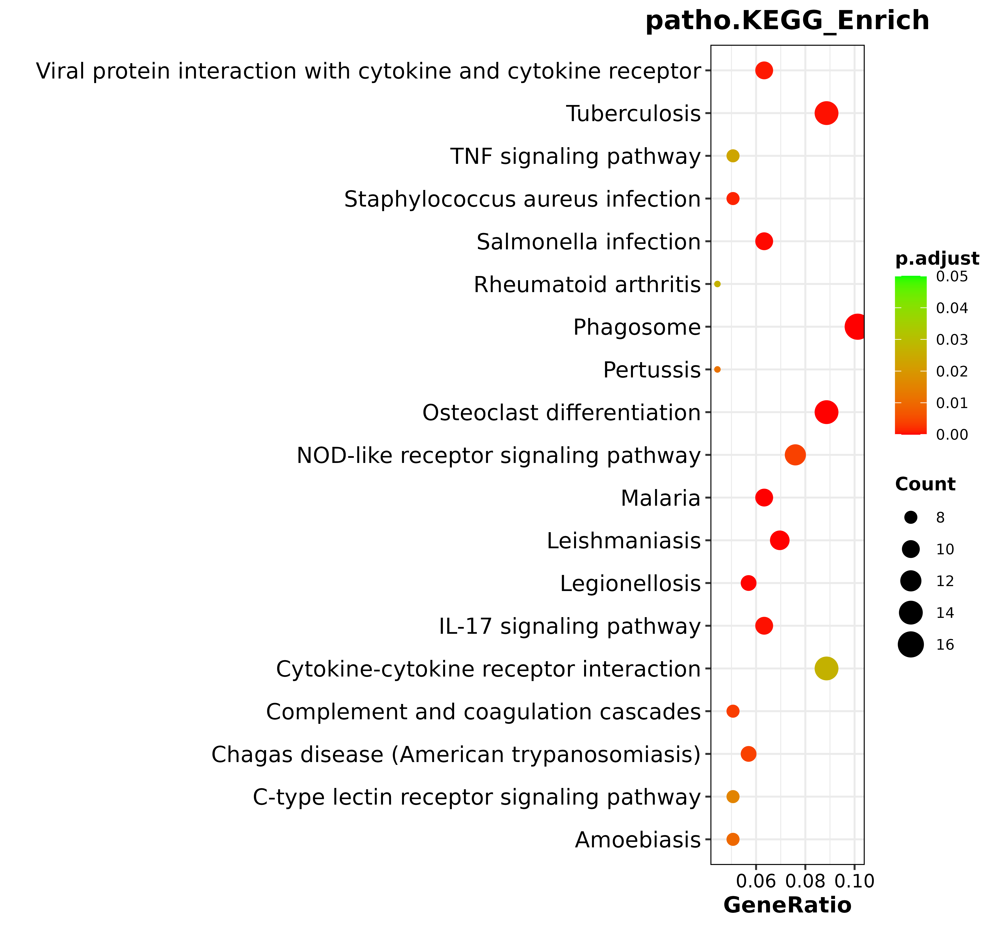

**Single cell biological information analysis process**


### Introduction

The types, states, and interactions of cells in human tissues vary greatly. Single-cell transcriptome sequencing (scRNA-SEQ) is a new technique for high-throughput sequencing analysis of the transcriptome in single cell. Single-cell transcriptome sequencing can complement conventional transcriptome sequencing (mRNA-seq: Batch RNA sequencing, comparing the average expression values of genes in all cells of the cell population), revealing the expression situation of all genes in the all-cause group in single cell, including the identified tissue cell types, reflecting the cell heterogeneity between different samples and the tissue microenvironment, so that we can better understand the real state and correlation of each cell in a Bulk tissue. Presents a real and comprehensive cellular world. Currently, single-cell transcriptome sequencing is mostly used in complex multicellular systems such as tumor, developmental, neural, and immune microenvironments.

The purpose of this tool is connect the analysis of single-cell data into a complete process to accelerate the speed of analysis and contribute to the progress in this field.

## A. Environment set up

### 1. Download docker

```bash
docker pull zhangjing12/scrnapip
```

### 2. Use docker

```bash
docker run -d -p 1921:8787 -p 1882:3838 -e PASSWORD=yourpassword -e USERID=youruserid -e GROUPID=yourgroupid -v /yourdatapath:/yourdatapath zhangjing12/scrnapip
```

The image is created based on Rocker (https://rocker-project.org/images/versioned/rstudio.html). You can use the above command to access rstudio through port 8787, which is more convenient for users to use the process. The userid and groupid can be queried through the id command. For the port number, please confirm whether the corresponding port is open.


## B. Start Workflow

### 1. Set config file

All input files and parameters are set in this configuration file. The main settings that need to be changed are the following：

```bash
#####[fastp_cellrange]:RAW data path. The pair end data must be split into two files
S1.R1=["/usr/data/SAMPLE1_S1_L001_R1_001.fastq.gz"]
S1.R2=["/usr/data/SAMPLE1_S1_L001_R2_001.fastq.gz"]
#If a sample has more than one raw data,you can merge them before or add path split by ",":
S1.R1=["/usr/data/SAMPLE1.1_S1_L001_R1_001.fastq.gz","/usr/data/SAMPLE1.2_S1_L001_R1_001.fastq.gz"]
S1.R2=["/usr/data/SAMPLE1.1_S1_L001_R2_001.fastq.gz","/usr/data/SAMPLE1.2_S1_L001_R2_001.fastq.gz"]

#####[indata]:cellranger matrix file path
S1="/usr/workout/02.cellranger/S1/outs/filtered_feature_bc_matrix"

#####[outpath]:output path
outpath="/usr/workout"

#####[tempdata]rds file output path
tempdata="workout"

#####[run]:The analysis that needs to be done should set to true,for example:
fastp=true#run fastp

#####[fastp]:Configure the fastp path and parameters
fastppath="/home/dataa/fastp"
longr=26#R1 length after trim
ncode=5#The maximum number of N-bases

#####[cellrangle]:Configure the cellranger path and parameters
dockerusr="1025:1025"#user id
dir="/user/name"#The folder which docker mount
ref="/user/refdata-gex-GRCh38-2020-A"#Reference genome path
cellrangerpath="/home/dataa/cellranger-7.1.0/cellranger"#software path of cellranger
expectcell=10000#expect cell number
localcores=32#Number of threads
localmem=64#Memory size
include_introns="false"#Whether to analyze introns

#####[step1]:
filetype="10x"#The format of the input file,could be "10x" or "csv"
csv_sep=""#Separator of the csv file
nFeature_RNA=[200,5000]#The cells were filtered by feature, keeping cells that feature between 200 and 5,000 
percent_mt=[0,10]#The cells were filtered by percent of mitochondria, keeping cells that percent of mitochondria less than 10%
mttype="MT"#Mitochondrial type, MT for humans and mt for mice

#####[step2]:
kfilter=200#Minimum number of cells per sample
normethod="SCT"#The merge method, which uses SCT by default, can also use vst to simply group samples together
nFeature=3000#Genes for subsequent analysis

#####[step3]:
recluster=true#Whether to perform batch correction
mode="harmony"#Method of batch correction
heatmapnumber=9#Number of heatmaps drawn for pca
elbowdims=100#The number of PCS shown in the elbow diagram
dims=30#Select the top 30 PCs for dimensionality reduction
reduction="umap"#tSNE or UMAP
clustercell=true#Whether you need to cluster cells
resolution=0.6#Set the resolution when clustering
algorithm=1#Cluster modular optimization algorithm (1 = original Louvain algorithm; 2 = Louvain algorithm with multilevel refinement; 3 = SLM algorithm
singler="/home/dataa/singleRdata/singleRdata/test.rds"#singleR database position

#####[step4]:
clustermarkers=true#Whether marker genes of each cluster need to be found
min_pct=0.25#The minimum proportion of marker gene in the number of cells is 0.25 by default
findmarkers_testuse="wilcox"#The method of finding marker gene
difcluster.test.a=[0,1]#Find Differential gene.If you want to find differences between samples,change cluster to ident
difcluster.test.b=[5,6]#Test indicates the group name,a for case and b for control
difcluster.test.testuse="wilcox"#Inspection method

#####[step5]:
meanexpression=0.5#Select the appropriate gene to mark the state, intercept the condition, default is 0.5
genenum=50#Number of gene in differential analysis heat map
numclusters=4#The number of clusters in a cluster
pointid=1#The branching points used in BEAM analysis
BEAMnumclusters=4#Number of clusters in heat map clustering
BEAMgn=50#BEAM analyzes heat map gene count
BEAMgenelist=["S100A12", "ALOX5AP", "PAD14", "NRG1", "MCEMP1", "THBS1","testgene"]#BEAM analyzes specific gene names

#####[step6]:
circosbin="/home/dataa/get_exp.r"#Extraction expression
circos_perl_bin="/home/dataa/circos_plot.pl"#Plot circos

#####[step7]:
copykat_bin="/home/dataa/copykat_v4.r"#Identify tumor cells

#####[step8]:
cytoTRACE_bin="/home/dataa/cytotrace_230508.R"#Developmental potential analysis

#####[step9]:
genomicinstably_bin="/home/dataa/genomicinstably.R"Genomic instability analysist
org="human"#species

#####[step11]:
ClusterProfiler=["true","Rscript","/home/dataa/clusterProfiler.test.R","-a true -s org.Hs.eg.db,hsa,human -g 1 -t SYMBOL -d KEGG,BioCyc,PID,PANTHER,BIOCARTA -C 0.05"]#-a:Whether to use all background genes;-s:species;-g:The column of the gene in the file;-t:gene name type(SYMBOL,ENTREZID);-d:database nam
```

### 2. Filtered data by fastp and cellranger

This R script is used for data filtering and comparison quantitative analysis, and relevant parameters are set in the configuration file config.ini.

```bash
Rscript fastp_cellranger.r -i config.ini
```

### 3. Seurat analysis

This R script is used for all advanced analyses, and relevant parameters are set in the configuration file config.ini.

```bash
Rscript singlecell.r -i config.ini
```

## C. Result

### 1. fastp

Sequence statistics and reads filtering result files were performed on the original data.

```bash
── 01.fastp/
     └── <SampleName>/                                  <- config for report
            ├── <SampleName>_fastp.html                 <- Report generated by fastp
            ├── <SampleName>_fastp.json                 <- Statistical information generated by fastp
            ├── <SampleName>_S1_L001_R1_001.fastq.gz    <- R1 clean data
            └── <SampleName>_S1_L001_R2_001.fastq.gz    <- R2 clean data
```



Quality control summary statistics by fastp.

### 2. Cellranger

Cellranger results after mapping and quantitative.

```bash
── 02.Cellranger/
     └── <SampleName>/                       
              └── outs/                                 <- Cellranger analysis results 
                    ├── analysis/                       <- Cluster by cellranger
                    ├── raw_feature_bc_matrix/          <- Unfiltered feature-barcode matrices MEX (usually not used)
                    ├── raw_feature_bc_matrix.h5        <- Unfiltered feature-barcode matrices HDF5
                    ├── filtered_feature_bc_matrix/     <- Filtered feature-barcode matrices MEX
                    ├── filtered_feature_bc_matrix.h5   <- Filtered feature-barcode matrices HDF5
                    ├── molecule_info.h5                <- Per-molecule read information
                    ├── metrics_summary.xls             <- Run summary information
                    ├── possorted_genome_bam.bam        <- Bam file of single cell alignment
                    ├── possorted_genome_bam.bam.bai    <- Bam index
                    └── web_summary.html                <- Run summary HTML
```


Cellranger web report.


### 3. CellFilter

Filter low-quality cells according to mitochondrial proportion and gene number

```bash
── 03.CellFilter/
     ├── <SampleName>/
     │          ├── <SampleName>_countVfeature.png/pdf  <- Scatter plot of nCounts and nFeature
     │          ├── <SampleName>_countVmt.png/pdf       <- Scatter plot of nCounts and percent.mito
     │          ├── <SampleName>_libraryVmt.png/pdf     <- Scatter plot of nCounts and percent.mito,nCounts as the color of the dot   
     │          └── <SampleName>_voilin.png/pdf         <- Violin plot with dots of nCounts,nFeature and percent.mito
     └── summary.txt/                                   <- Summary statistical information of cell filtration
```


Scatter plot of feature and UMIs for all cells.Filter the cells outside the two red lines.


Scatter plot of  percent mitochondria and UMIs for all cells.Filter the cells above the red lines.


### 4. PCA_UMAP

Dimensionality reduction and clustering to filtered cells.Annotate cells with singleR.

```bash
── 04.PCA_UMAP/
     ├── pca/
     │    ├── bowplot.png/pdf               <- Standard Deviation of top 50 PC
     │    ├── pca.png/pdf                   <- Sample distribution of pc1 and pc2
     │    └── pcaheatmap1.png/pdf           <- Heatmap of genes in a pc
     └── umap/
          ├── barplot.png/pdf               <- The proportion of each sample in each cluster
          ├── celltype.png/pdf              <- The cell type identified by singleR
          ├── cluster0.png/pdf              <- Pie charts of the percentage of cell types in each cluster
          ├── plotall_ident.png/pdf         <- Umap plot of samle
          ├── plotby_cluster.png/pdf        <- Umap plot of cluster
          ├── plotby_ident.png/pdf          <- Umap plot splited by sample 
          ├── plotby_nCount.png/pdf         <- Umap plot of nCount
          ├── singleR_celltype.xls          <- Statistical table of cell types determined by singleR
          └── summary.xls                   <- The number of cells per cluster in each sample
```


The single cell expression matrix was reduced and clustering to obtain the final umap plot. The dots represent cells, and clusters split by colors.


The distribution of samples in umap is shown. The dots represent cells, and samples split by colors.


UMAP plot for cell type annotation.


### 5. BatchCorrected

### 5. MarkerGene

Find marker genes and display result by violin and feature umap.

```bash
── 05.MarkerGene/
     ├── cluster* /
     │       ├── cluster_genelist.xls                    <- Marker genes of a cluster
     │       ├── cluster_genereduction.png/pdf           <- Feature plot of top 10 marker genes
     │       ├── cluster_genevlnplot.png/pdf             <- Violin plot of top 10 marker genes
     │       └── cluster_padj0.05_logFC0.5genelist.xls   <- Filtered marker genes by padj<0.05 and logFC>0.5
     ├── custer/
     │       └── Celltype
     │              ├── *_reduction.png/pdf              <- Feature plot of the genes entered in the config file
     │              └── *_vlnplot.png/pdf                <- Violin plot of the genes entered in the config file
     ├── cluster_top10geneheatmap.png/pdf                <- Heat maps of the top 10 marker genes in all clusters
     ├── clusterall_adj0.05_logFC0.5genelist.xls         <- All filtered marker genes of all clusters
     └── clusterall_top10genelist.xls                    <- Top 10 marker genes of all clusters
```


Umap plot of top10 marker gene  for each cluster.




 Violin plot of top 10 marker gene for each cluster.


Heatmap of top 10 marker gene for each cluster.


### 6. Pseudotime

To perform pseudotime analysis of the cells,we used monocle2  to select high discrete gene and draw trajectory diagram.By default, the first branch point is used for beam analysis.If you want to analyze other branch points,setting in the configuration file.

```bash
── 06.Pseudotime/
     ├── pseudotime /
     │    ├── geneplot.png/pdf                      <- Scatter plot for selecting high discrete gene
     │    ├── pseudotime_byclusters.png/pdf         <- Cell trajectory plot,colors represent different clusters
     │    ├── pseudotime_byPseudotime.png/pdf       <- Cell trajectory plot,colors represent the level of expression
     │    ├── pseudotime_bystate.png/pdf            <- Cell trajectory plot,colors represent different state
     │    ├── pseudotime_splitbyclusters.png/pdf    <- Cell trajectory plot split by clusters
     │    ├── pseudotime_splitbyorig.ident.png/pdf  <- Cell trajectory plot split by samples
     │    └── cell_state_clusters.xls               <- Cell state statistical table
     ├── BEAM /
     │    ├── custergene.png/pdf                    <- Gene expression in different branches of cells
     │    ├── top10gene.png/pdf                     <- Top 10 gene expression in different branches of cells
     │    ├── topgeneheatmap.pdf                    <- Heatmap for genes in different branches
     │    └── diffgenelist.xls                      <- p-value and q-value of genes
     ├── diffgenes /
     │    ├── topgeneheatmap.pdf                    <- Heatmap for genes in different branches
     │    └── cell_diffgene.xls                     <- p-value and q-value of genes
     └── QC.png/pdf
```


Cell trajectory plot drawed by monocle.


### 7. Cerebro

Cerebro(cell report browser), which allows users to interactively visualize various parts of single cell transcriptomics data without requiring bioinformatic expertise.Cerebro can draw various graphs to display single cell results like umap/tsne for 2D/3D,bar plot,violin plot,cluster tree etc.


### 8. ClusterProfiler

Gene pathway enrichment analysis is to find a class of overexpressed genes in a set of genes. Here, based on five databases including BIOCARTA, BioCyc, GO, KEGG, and reactome, we perform enrichment analysis on the marker genes of the cluster respectively.

```bash
── 12.clusterProfiler/ 
           ├── <prefix>.BIOCARTA_Enrich.xls          <- Gene enrichment analysis results based on BIOCARTA database 
           ├── <prefix>.BioCyc.png/pdf               <- Bubble plot of gene enrichment analysis based on BIOCARTA database 
           ├── <prefix>.BioCyc_Enrich.xls            <- Gene enrichment analysis results based on BioCyc database 
           ├── <prefix>.BP.DAG.svg                   <- Directed acyclic graph of biological processes in gene ontology 
           ├── <prefix>.CC.DAG.svg                   <- Directed acyclic graph of cellular component in gene ontology 
           ├── <prefix>.MF.DAG.svg                   <- Directed acyclic graph of molecular function in gene ontology 
           ├── <prefix>.go.pdf/png                   <- Barplot with significantly enriched GO terms 
           ├── <prefix>.GO_Enrich.xls                <- Gene enrichment analysis results based on gene ontology database 
           ├── <prefix>.KEGG.png/pdf                 <- Bubble plot of gene enrichment analysis based on KEGG database 
           ├── <prefix>.KEGG_Enrich.xls              <- Gene enrichment analysis results based on KEGG database 
           ├── <prefix>.PANTHER_Enrich.xls           <- Gene enrichment analysis results based on PANTHER database 
           ├── <prefix>.PID_Enrich.xls               <- Gene enrichment analysis results based on PID database 
           ├── <prefix>.reactome.png/pdf             <- Bubble plot of gene enrichment analysis based on reactome database 
           └── <prefix>.Reactome_Enrich.xls          <- Gene enrichment analysis results based on reactome database
```


Barplot with significantly enriched GO terms.




The bubble plot for KEGG enriched analysis.


### 9. Copykat

Copykat is used to perform copy number analysis and predict tumor cells.The umap plot is used to display the results.

Copykat(Copynumber Karyotyping of Tumors) is a computational tool using integrative Bayesian approaches to identify genome-wide aneuploidy at 5MB resolution in single cells to separate tumor cells from normal cells, and tumor subclones using high-throughput sc-RNAseq data.

```bash
── 09.Copykat/
     ├── <SampleName1> /
     │    ├── <SampleName1>_copykat_clustering_results.rds            <- RDS file containing copykat results
     │    ├── <SampleName1>_copykat_CNA_raw_results_gene_by_cell.txt  <- Expression matrix sorted by absolute position of genes
     │    ├── <SampleName1>_copykat_CNA_results.txt                   <- Copy number variation of cells at each chromosomal location
     │    ├── <SampleName1>_copykat_heatmap.jpeg                      <- Heatmap of tumor cell prediction results
     │    ├── <SampleName1>_copykat.pdf                               <- Heatmap of tumor cell prediction results
     │    ├── <SampleName1>_copykat_prediction.txt                    <- Tumor cell predicted results of copycat
     │    ├── <SampleName1>_copykat_with_genes_heatmap.pdf            <- Heatmap of tumor cell prediction results with gene names
     │    ├── <SampleName1>_rawdata.txt                               <- Raw umi expression matrix
     │    ├── <SampleName1>.tumor_subtype.pdf                         <- Heatmap of prediction results of tumor subclonal types
     │    └── <SampleName1>.tumor_subtype.txt                         <- Tumor subclonal type
     ├── <SampleName2> /
     ├── ...
     │
     ├── copykat.counts.clusterbarplot.pdf/png                        <- Barplot of the cell number by clusters, arranged by tumor cells
     ├── copykat.counts.samplebarplot.pdf/png                         <- Barplot of the cell number by samples
     ├── copykat.prop.clusterbarplot.pdf/png                          <- Barplot of the proportion of cell by clusters
     ├── copykat.prop.samplebarplot.pdf/png                           <- Barplot of the proportion of cell by samples
     ├── copykat.umap.pdf/png                                         <- Umap plot of tumor cell prediction results
     ├── copykat.umap.splitsample.pdf/png                             <- Umap plot of tumor cell prediction results splited by samples
     └── Summary_copykat_prediction.txt                               <- Predicted results for all sample cells
```


Heatmap of copykat prediction results.


### 10. genomicInstability

Genomic instability analysis (GIA) uses the aREA algorithm to quantitatively estimate the association between gene expression and chromosomal location by performing enrichment analysis of contiguously coded genes (loci-blocks) on the single cell gene expression profiles.

```bash
── 11.genomicInstability/
     ├── <prefix>_genomicinstability.pdf             <- Density plot of the gene instability score
     ├── <prefix>_genomicinstability.withanno.pdf    <- Density plot of the gene instability score with annotated information
     └── <prefix>_gis.result.txt                     <- Table containing genomic instability score and cell names
```


The genomic Instability score density plot.


### 11. CellChat

 CellChat, a tool that is able to quantitatively infer and analyze intercellular communication networks from single-cell RNA-sequencing (scRNA-seq) data. CellChat predicts major signaling inputs and outputs for cells and how those cells and signals coordinate for functions using network analysis and pattern recognition approaches. Through manifold learning and quantitative contrasts, CellChat classifies signaling pathways and delineates conserved and context-specific pathways across different datasets. 

```bash
── 13.CellChat  /
     ├── bubble /
     │      └── <CellType>_bubble.pdf        <- A bubble plot showing the strength of gene communication between cell types
     ├── pathway /
     │      ├── <GeneName>_circle.pdf        <- Circle plot of gene signaling pathway network of each gene
     │      └── <GeneName>_hier.pdf          <- Hierarchy plot of gene signaling pathway network of each gene
     ├── <CellType>_circle.pdf               <- Circle plot of interacting gene numbers of each cell type
     └── topgeneheatmap.pdf                  <- Circle plot of gene signaling pathway newtwork
```


### 12. CytoTRACE

CytoTRACE (Cellular (Cyto) Trajectory Reconstruction Analysis using gene Counts and Expression) is a computational method that predicts the differentiation state of cells from single-cell RNA-sequencing data. CytoTRACE leverages a simple, yet robust, determinant of developmental potential—the number of detectably expressed genes per cell, or gene counts. CytoTRACE have been validated on ~150K single-cell transcriptomes spanning 315 cell phenotypes, 52 lineages, 14 tissue types, 9 scRNA-seq platforms, and 5 species.

```bash
── 10.CytoTRACE/ 
       ├── <prefix>.CytoTRACE.boxplot_raw.pdf/png     <- Boxplot of cytotrace scores by cluster 
       ├── <prefix>.CytoTRACE.boxplot_type.pdf/png    <- Boxplot of cytotrace scores by cell type 
       ├── <prefix>.cytovalue.FeaturePlot.pdf/png     <- Umap plot characterized by cytotrace scores 
       ├── <prefix>CytoGenes.pdf                      <- Genes that most correlated with cytotrace score 
       └── <prefix>.CytoTRACE.table.txt               <- Table containing cytotrace scores and cell names
```


Boxplots ordered by median cytotrace score.


#### Citations:

[1]R Core Team (2022). R: A language and environment for statistical computing. R Foundation for Statistical Computing, Vienna, Austria.

[2]Chen S, Zhou Y, Chen Y, Gu J. fastp: an ultra-fast all-in-one FASTQ preprocessor. Bioinformatics. 2018;34(17):i884-i890.

[3]Chen, Shifu. "Ultrafast one‐pass FASTQ data preprocessing, quality control, and deduplication using fastp." iMeta (2023): e107.

[4]Zheng GX, Terry JM, Belgrader P, et al. Massively parallel digital transcriptional profiling of single cells. Nat Commun. 2017;8:14049. Published 2017 Jan 16.

[5]Hao Y, Hao S, Andersen-Nissen E, et al. Integrated analysis of multimodal single-cell data. Cell. 2021;184(13):3573-3587.

[6]Qiu X, Hill A, Packer J, Lin D, Ma YA, Trapnell C. Single-cell mRNA quantification and differential analysis with Census. Nat Methods. 2017;14(3):309-315. 

[7]Zhao J, Zhang S, Liu Y, et al. Single-cell RNA sequencing reveals the heterogeneity of liver-resident immune cells in human. Cell Discov. 2020;6:22. Published 2020 Apr 28.

[8]Abdi H, Williams LJ. Principal component analysis. Wiley Interdisciplinary Reviews: Computational Statistics. 2010;2:433–459. 

[9]McInnes, L., Healy, J., Saul, N. & Großberger, L. UMAP: uniform manifold approximation and projection. J. Open Source Softw. 3, 861 (2018).

[10]Van Der Maaten, L. & Hinton, G. Visualizing high-dimensional data using t-SNE. journal of machine learning research. J. Mach. Learn. Res. 9, 26 (2008).

[11]Blondel, V. D., Guillaume, J.-L., Lambiotte, R. & Lefebvre, E. Fast unfolding of communities in large networks. J. Stat. Mech. 2008, P10008 (2008).

[12]Aran D, Looney AP, Liu L, et al. Reference-based analysis of lung single-cell sequencing reveals a transitional profibrotic macrophage. Nat Immunol. 2019;20(2):163-172.

[13]Hillje R, Pelicci PG, Luzi L. Cerebro: interactive visualization of scRNA-seq data. Bioinformatics. 2020;36(7):2311-2313.

[14]Gu Z, Gu L, Eils R, Schlesner M, Brors B. circlize Implements and enhances circular visualization in R. Bioinformatics. 2014;30(19):2811-2812.

[15]Wickham H. (2016) ggplot2: Elegant Graphics for Data Analysis. Springer-Verlag, New York. ISBN 978-3-319-24277-4

[16]Gao R, Bai S, Henderson YC, et al. Delineating copy number and clonal substructure in human tumors from single-cell transcriptomes. _Nat Biotechnol_. 2021;39(5):599-608. 

[17]Gulati GS, Sikandar SS, Wesche DJ, et al. Single-cell transcriptional diversity is a hallmark of developmental potential. _Science_. 2020;367(6476):405-411.

[18]Jin S, Guerrero-Juarez CF, Zhang L, et al. Inference and analysis of cell-cell communication using CellChat. _Nat Commun_. 2021;12(1):1088. Published 2021 Feb 17.

[19]Nust, D., Eddelbuettel, D., Bennett, D., Cannoodt, R., Clark, D., Daroczi, G., ... & Xiao, N. (2020). The Rockerverse: Packages and Applications for Containerisation with R. R JOURNAL, 12(1), 437-461.

[20]Gao R, Bai S, Henderson YC, et al. Delineating copy number and clonal substructure in human tumors from single-cell transcriptomes. _Nat Biotechnol_. 2021;39(5):599-608.

[21]Gulati GS, Sikandar SS, Wesche DJ, et al. Single-cell transcriptional diversity is a hallmark of developmental potential. _Science_. 2020;367(6476):405-411.

[22]Yu G, Wang LG, Han Y, He QY. clusterProfiler: an R package for comparing biological themes among gene clusters. OMICS. 2012;16(5):284-287.

[23]Jin S, Guerrero-Juarez CF, Zhang L, et al. Inference and analysis of cell-cell communication using CellChat. _Nat Commun_. 2021;12(1):1088. Published 2021 Feb 17.

[24]Haghverdi L, Lun ATL, Morgan MD, Marioni JC. Batch effects in single-cell RNA-sequencing data are corrected by matching mutual nearest neighbors. Nat Biotechnol. 2018;36(5):421-427.

[25]Korsunsky I, Millard N, Fan J, et al. Fast, sensitive and accurate integration of single-cell data with Harmony. Nat Methods. 2019;16(12):1289-1296.
